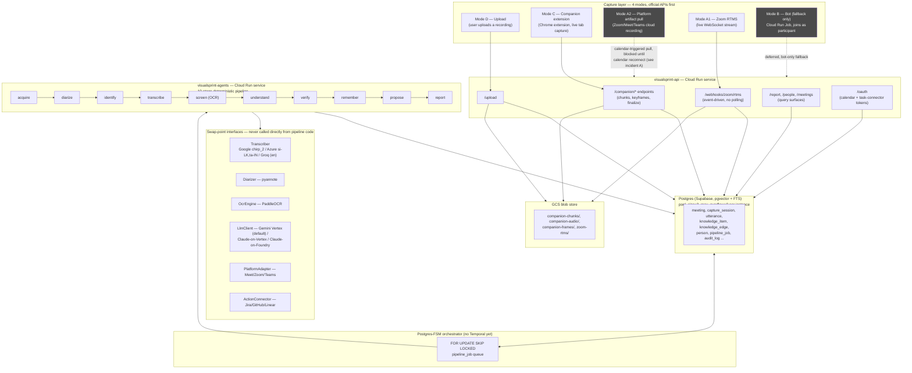
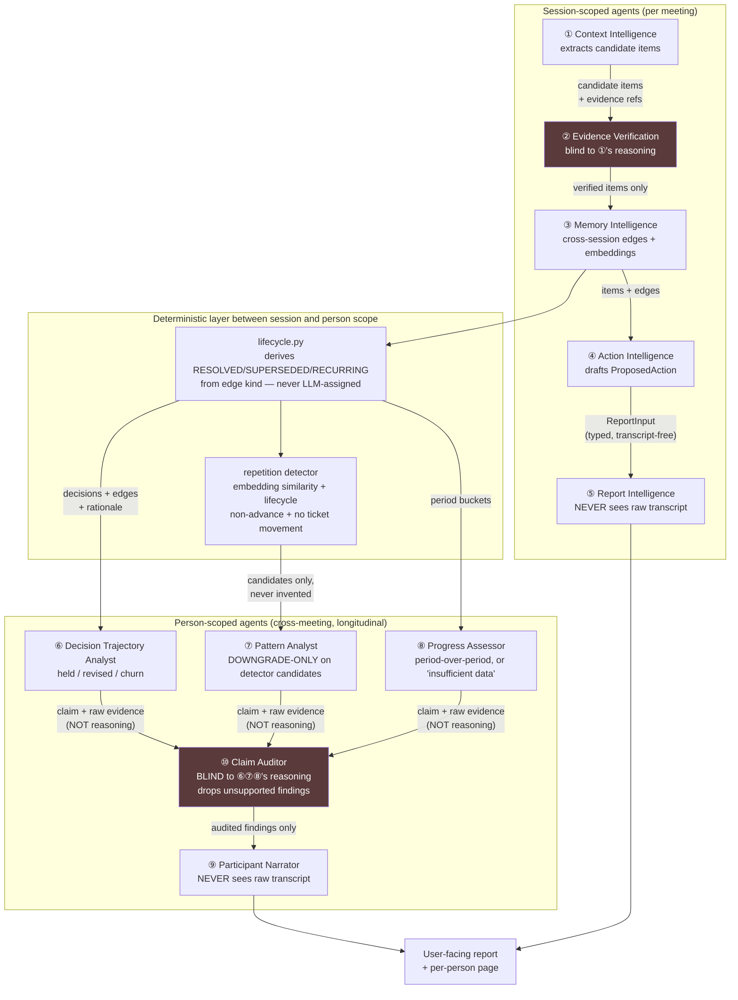

# Full System Context — Architecture, Multi-Agent Roster, and the 2026-08-27 Incident Log

This document is a single-file snapshot of **everything relevant to the current
debugging session**: the full system architecture, the complete multi-agent roster,
every root cause found this session and the previous one, and their fixes. It exists
so a fresh session (human or Claude) can reconstruct full context without re-deriving
it from Cloud Run logs and git history again.

It intentionally overlaps with `02-architecture.md`, `11-agent-architecture.md`, and
`14-production-status.md` — those are the living documents; this one is the
point-in-time incident record. Update those three when architecture changes; add to
this one when a new incident is diagnosed.

---

## 1. System architecture

VisualSprint is multilingual (Sinhala / Tamil / English) meeting-intelligence
software. It captures a meeting through one of several capture modes, runs it through
a fixed 10-stage deterministic pipeline, and produces a report with per-claim
evidence (transcript span + screenshot).

### 1.1 High-level architecture diagram



### 1.2 Non-negotiable architecture rules (from `CLAUDE.md`, do not re-litigate)

1. Deterministic software owns the workflow — agents never call each other or choose
   the next stage.
2. `ReportInput` cannot contain raw transcript — type-enforced, not a prompt instruction.
3. Verification never sees the extractor's reasoning — self-consistency ≠ verification.
4. Every vendor goes through a swap-point interface (`Transcriber`, `Diarizer`,
   `OcrEngine`, `LlmClient`, `PlatformAdapter`, `ActionConnector`).
5. `proposed_action` cannot execute without an approval record — a DB CHECK
   constraint, not app logic.
6. Capture gaps are data (`coverage_interval` rows), never silence.

### 1.3 Key infrastructure facts learned/re-confirmed this session

- **Supabase free-tier pooler hard-limits 15 total connections** across all clients.
  With 2× `api` + 2× `agents` possible instances, `pool_size=3, max_overflow=0` per
  engine = 12 total, safely under the limit (`8b9970e`, `3b795ba`).
- **Cloud Run default concurrency is 80 requests per instance** — far higher than the
  DB pool size. Any handler that holds a DB connection across network I/O (GCS
  upload/download) can starve the pool the moment ≥4 requests land concurrently
  (see Incident 4 below).
- **CI runs a *separate* Postgres database** (`visualsprint_test`) from what the app
  engine would use in production-shaped config (`visualsprint`). Any code path that
  builds its own `Session` via `get_sessionmaker()()` instead of `Depends(get_db)`
  bypasses FastAPI's `dependency_overrides` and silently talks to the wrong DB in
  tests (see Incident 5 below).
- `agents` service scales 0→2 with `--min-instances=0`; RTMS's in-process
  `_active_streams` dict is therefore inherently fragile — this is a **known,
  deliberately accepted** limitation (see `docs/14-production-status.md` cause C),
  not something to "fix" without budget for an always-on instance.

---

## 2. Multi-agent architecture

Nine LLM agents + one critic. **"Multi-agent" here means many narrow specialists that
never talk to each other** — every arrow in and out is deterministic code (rule 1
above). Full detail: `docs/11-agent-architecture.md`. Summary + diagram below.

### 2.1 The complete roster

| # | Agent | Scope | Job | Model tier | Sees raw transcript? |
|---|---|---|---|---|---|
| 1 | Context Intelligence | session | Extract candidate knowledge items from utterances + keyframes | reasoning | yes (input side only) |
| 2 | Evidence Verification | session | Re-check each claim against raw evidence, **blind to the extractor's reasoning** | reasoning | evidence only |
| 3 | Memory Intelligence | session | Propose cross-session edges; write embeddings | reasoning | no |
| 4 | Action Intelligence | session | Draft an actionable task from an item | cheap | no |
| 5 | Report Intelligence | session | Write the meeting report from a **transcript-free** input | reasoning | **never** (rule 2) |
| 6 | Decision Trajectory Analyst | person | Did a decision hold, get revised (principled), or churn? | reasoning | no |
| 7 | Pattern Analyst | person | Judge deterministically-detected repetition candidates — **downgrade-only**, never invents a finding | reasoning | no |
| 8 | Progress Assessor | person | Period-over-period movement; "insufficient data" is a valid answer | reasoning | no |
| 9 | Participant Narrator | person | Write the per-person professional summary | writing tier | **never** |
| 10 | Claim Auditor | person | Independently verify 6/7/8's claims against evidence, **blind to their reasoning** | reasoning | evidence only |

### 2.2 Multi-agent data-flow diagram



The two agents shaded above (Evidence Verification, Claim Auditor) are the "blind
critic" pattern applied at two different scopes — session-level and person-level.
This is the single most load-bearing accuracy mechanism in the system: **a critic
that never sees the reasoning that produced a claim, only the claim and the raw
evidence.** Self-consistency (an agent re-checking its own reasoning) is explicitly
rejected as verification.

### 2.3 Two known accuracy defects (still open, not part of this session's incidents)

1. **Sampling is uncontrolled** — no `temperature` parameter on `LlmClient`; every
   call runs at the model default (~1.0), which is non-reproducible for tasks that
   have exactly one right answer (extraction, verification, classification).
2. **Agent accuracy is never measured** — `app/evaluation/` has an ASR harness but no
   golden set / precision-recall / regression gate for any of the 10 agents above.

Full remediation plan for both: `docs/11-agent-architecture.md` §"Accuracy
engineering" (sections A–J), build order at the bottom of that file.

---

## 3. Incident log — this session (2026-08-27)

Investigated after the user ran a live Google Meet test through the Chrome extension
and reported "meeting hasn't been detected" and asked to "check all and fix full
pipeline." Six distinct root causes were found and fixed; three more were found and
remain open at the end of this session.

### Incident 1 — AudioContext starts `"suspended"` in the offscreen document

**Symptom:** Companion session created, keyframes uploaded, but zero audio chunks
ever arrived — recording looked "active" but was capturing silence.

**Root cause:** `extension/offscreen/offscreen.js` creates a `new AudioContext()` to
mix tab + mic audio. Offscreen documents have no user-gesture context, so the
`AudioContext` starts in `"suspended"` state. Audio routed through a suspended
context is silent → `MediaRecorder` emits zero-size chunks → the `e.data.size === 0`
guard silently drops them.

**Fix (`3b795ba`):** Explicit `await _audioCtx.resume()` before checking state is
`"running"`. If resume fails, fall back to recording the raw tab stream directly
(loses the local user's own mic audio, but captures everyone else — partial audio
beats none).

---

### Incident 2 — `OFFSCREEN_ERROR` silently dropped by the service worker

**Symptom:** When capture setup failed inside the offscreen document, nothing
surfaced to the user — no notification, no badge change, session left dangling.

**Root cause:** `extension/background/service_worker.js` had no `case` for the
`OFFSCREEN_ERROR` message type in its `chrome.runtime.onMessage` listener.
Additionally, the offscreen document's error message never included `sessionId`,
so even a handler couldn't have matched the error back to a session.

**Fix (`382ab6f`):** Added `sessionId` to the `OFFSCREEN_ERROR` payload; added a
handler that sets a red error badge, fires a `chrome.notifications` alert, and calls
`stopRecording()` to clean up the dangling session state.

---

### Incident 3 — Meeting not detected after reloading the extension

**Symptom:** User reloaded the extension (picking up prior fixes), rejoined a Meet
call already open in a tab, and the extension never showed the "recording available"
badge — as if the detector script wasn't running at all.

**Root cause:** Reloading an MV3 extension from `chrome://extensions` invalidates
every content script already injected into open tabs — they become "zombie"
contexts where `chrome.runtime.*` throws `Extension context invalidated`. The
detector script (`extension/content/detector.js`) was correct — verified live via
the in-app browser against a real Meet call (`button[aria-label="Leave call"]` is
present in the DOM, and the URL pattern `/[a-z]{3}-[a-z]{4}-[a-z]{3}/` matches) — but
it was a corpse in an already-open tab.

**Fix (`c14824d`):** `chrome.runtime.onInstalled.addListener` in the service worker
now re-injects `content/detector.js` into every open Meet/Zoom/Teams tab whenever the
extension is installed or reloaded — no manual tab reload required by the user going
forward.

---

### Incident 4 — DB connection pool exhausted by concurrent GCS uploads

**Symptom:** After incidents 1–3 were fixed, the same meeting test produced real
audio chunks, but `finalize` returned `500 Internal Server Error`, and `keyframes`
intermittently did too.

**Root cause traced via Cloud Run logs:**
```
sqlalchemy.exc.TimeoutError: QueuePool limit of size 3 overflow 0 reached,
connection timed out, timeout 30.00
```
`upload_chunk`, `upload_keyframe`, and `finalize_session`
(`backend/app/api/companion.py`) each held their FastAPI-injected DB `Session`
**open for the entire duration of a GCS network call** (`blob_store.put`/`.get`).
Cloud Run's default concurrency is 80 requests per instance; with chunks arriving
every 5 seconds from an active recording, plus a concurrent keyframe upload and an
escalation poll, 4 simultaneous requests needing a DB connection is completely
ordinary — but `pool_size=3, max_overflow=0` (set in Incident 5's related earlier fix,
`8b9970e`/`3b795ba`, to respect Supabase's 15-connection cap) meant the 4th request
waited the full 30s `pool_timeout` and then 500'd.

The finalize 500 specifically happened **inside the auth dependency**
(`get_current_user` → `db.get(User, user_id)`), before `finalize`'s own body-level
`total_chunks` check even ran — meaning chunks genuinely had been uploaded (the
AudioContext fix worked), but the request never got far enough to say so.

**Fix (`ffcd7ce`):** Each of the three endpoints now calls `db.close()` immediately
after the point where the DB is no longer needed and before any GCS network call:
- `upload_chunk` — closes DB right after auth; never touches DB again.
- `upload_keyframe` — closes before the GCS `put`; SQLAlchemy transparently
  reconnects for the subsequent `Keyframe` row insert.
- `finalize_session` — closes before the (potentially large) chunk-download +
  WAV-encode + WAV-upload sequence; **re-fetches the `CaptureSession`** afterward
  since `db.close()` detaches the object from the session.

---

### Incident 5 — RTMS webhook bypassed `Depends(get_db)`, breaking 3 CI tests

**Symptom:** CI failed on `main` — 3 tests in `tests/api/test_rtms_webhook.py` all
asserted `404 == 200`.

**Root cause:** `app/api/rtms_webhook.py::zoom_rtms_webhook` called
`get_sessionmaker()()` directly to build its own `Session`, instead of declaring
`db: Session = Depends(get_db)`. CI's `quality.yml` runs the API test suite against a
**separate** database (`VS_TEST_DATABASE_URL` → `visualsprint_test`) from the one the
app's global engine is configured for (`VS_DATABASE_URL` → `visualsprint`).
`tests/api/conftest.py`'s `client` fixture overrides `get_db` via
`app.dependency_overrides` so every route sees the test session/DB — but a route
that manually instantiates its own session via `get_sessionmaker()` **bypasses that
override entirely** and silently queries the wrong database. The test's
`OrgConnection`/`CaptureSession` rows existed only in `visualsprint_test`; the
handler queried `visualsprint` and found nothing → 404.

This bug existed only in test/CI (production always points both at the same
database), but it blocked every deploy from `main` since `quality.yml` gates
`deploy.yml`.

**Fix (`53b74bb`):** Switched the endpoint signature to
`db: Session = Depends(get_db)`. Added explicit `db.close()` calls on every branch
that doesn't need the DB (`endpoint.url_validation`, `meeting.started`, the
catch-all "ignored event" branch) to release the pool slot promptly — same pattern
as Incident 4's fix, applied proactively here since this endpoint receives high-volume
Zoom lifecycle events that mostly don't touch the DB at all.

---

### Incident 6 — `paddlepaddle` missing from the `agents` Docker image *(still open)*

**Symptom:** Every session's `screen` (OCR) stage fails on every attempt:
```
Engine 'paddle_static' is unavailable because dependency 'paddlepaddle' is not installed.
```

**Root cause:** An earlier fix (`a78493c`) corrected PaddleOCR's `show_log` argument
(removed in PaddleOCR 3.x) but the `agents` Docker image never had `paddlepaddle`
added as an actual Python dependency. The pipeline's stage-retry logic means this
doesn't block the pipeline — `screen` exhausts its retries and the FSM proceeds to
`understand` regardless — but it means **no meeting has ever gotten OCR/screenshot
evidence into a report**, which CLAUDE.md flags as a first-class, non-optional
feature ("Reports embed screenshot evidence, not just links").

**Status: not fixed this session.** Needs `paddlepaddle` added to the agents image's
dependency list and a rebuild.

---

### Incident 7 — Two zombie `PipelineJob` rows retrying forever *(still open)*

**Symptom:** Two sessions (`30e27e2e-...` and `60b632a3-...`) appear repeatedly in
`agents` logs, retrying `transcribe` every ~2 minutes, always with:
```
audio_track ... has invalid uri '' — expected blob:// scheme;
this session cannot be transcribed
```

**Root cause:** These sessions predate the `90bff8e` fix that asserts
`blob_store.put()` returns a valid `blob://` URI before committing an `AudioTrack`
row. Their `audio_track.uri` is permanently `''`, so `transcribe` can never succeed
— but nothing marks the job `FAILED`, so the worker keeps retrying on every sweep,
wasting cycles.

**Status: not fixed this session.** Needs a one-time manual `UPDATE pipeline_job SET
status='FAILED' WHERE id IN (...)` (or the `/failed-jobs` requeue-adjacent admin
path) to stop the loop. Offered to the user; not yet actioned.

---

### Incident 8 — Companion session `d939e32e-...` stuck in `SCHEDULED` *(likely resolved by Incident 4's fix, unverified)*

**Symptom:** The meeting test that surfaced Incident 4 left its `CaptureSession`
permanently in `SCHEDULED` state — `finalize` 500'd before `session.state =
CaptureState.ACQUIRING` and `enqueue_pipeline()` ever ran, even though the chunks it
needed already existed in GCS.

**Status:** Once Incident 4's fix (`ffcd7ce`) is deployed, `finalize_session`'s
existing idempotency guard (`if session.state != CaptureState.SCHEDULED: ... return
early`) means it's safe to either (a) redo a fresh meeting test, or (b) manually
re-POST `finalize` for this exact session — the chunks are still sitting in GCS
under `companion-chunks/{org_id}/d939e32e-.../`. Not yet re-attempted at end of
session.

---

### Incident 9 — `report.generated items=0` on a full successful pipeline run

**Symptom:** A separate debug session (`e53df062-...`, run via
`scripts/debug_pipeline.py`, unrelated to the live Meet tests above) completed **all
10 stages successfully** — acquire → diarize → identify → transcribe → understand →
verify → remember → propose → report all logged `stage.done` — but the final report
had zero knowledge items (`report.generated input_tokens=278 items=0
output_tokens=28`).

**Root cause:** Not diagnosed as a bug — most likely the test audio for that debug
run was too short or contained no extractable decisions/commitments/blockers for
Context Intelligence to surface. This is the expected, correct behavior of the
abstention-first design (`docs/11-agent-architecture.md` §C) when there's nothing to
extract, not a defect. Needs re-verification against a real meeting with substantive
conversation before drawing any conclusion.

**Status: open, low priority** — blocked on getting one full end-to-end real-meeting
test through the now-fixed capture path (Incidents 1–5).

---

## 4. Summary table — everything found this session

| # | Component | Root cause | Status | Commit |
|---|---|---|---|---|
| 1 | Extension (offscreen) | `AudioContext` suspended → silent audio | **Fixed** | `3b795ba` |
| 2 | Extension (service worker) | `OFFSCREEN_ERROR` silently dropped, missing `sessionId` | **Fixed** | `382ab6f` |
| 3 | Extension (service worker) | Content scripts invalidated on extension reload | **Fixed** | `c14824d` |
| 4 | Backend (`companion.py`) | DB pool exhausted holding connections across GCS I/O | **Fixed** | `ffcd7ce` |
| 5 | Backend (`rtms_webhook.py`) | Manual `get_sessionmaker()` bypassed test's `Depends(get_db)` override | **Fixed** | `53b74bb` |
| 6 | Backend (`agents` image) | `paddlepaddle` missing → `screen` stage always fails | **Open** | — |
| 7 | Data (`pipeline_job`) | Two sessions permanently stuck retrying `transcribe` with empty URI | **Open** | — |
| 8 | Data (`capture_session`) | One session stuck `SCHEDULED` from the pre-fix finalize 500 | **Open, likely self-resolves** | — |
| 9 | Pipeline (agents) | One debug run completed with 0 knowledge items extracted | **Open, needs real-meeting re-test** | — |

## 5. What to do next (priority order)

1. **Wait for CI to deploy `53b74bb`** (fixes the RTMS test failures blocking every
   deploy) and `ffcd7ce` (fixes the pool exhaustion) — both must be live before any
   further live testing is meaningful.
2. **Kill the two zombie sessions** (Incident 7) — one SQL update, frees worker cycles.
3. **Reload the extension** (picks up incidents 1–3) and **do one fresh, full-length
   (90s+) real Google Meet test** — this single test should resolve or clarify
   Incidents 8 and 9 simultaneously.
4. **Add `paddlepaddle` to the agents Docker image** (Incident 6) so reports finally
   carry screenshot evidence, per CLAUDE.md's non-negotiable requirement.
5. Only after a real meeting has produced a real report with real knowledge items:
   revisit the two *known, pre-existing* accuracy defects in §2.3 (temperature
   control, agent eval harness) — they are unrelated to this session's incidents and
   were already tracked in `docs/11-agent-architecture.md` before this session began.
