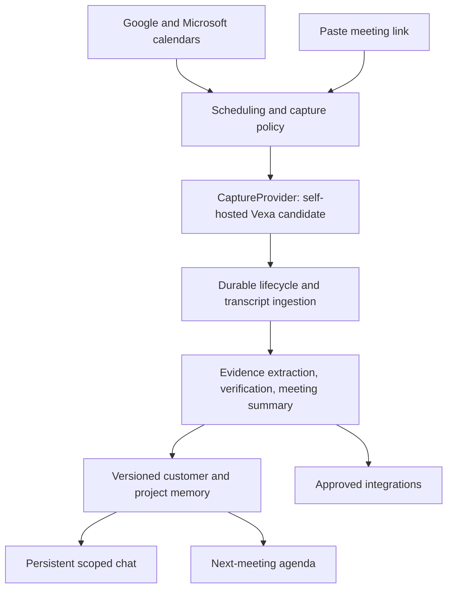

# VisualSprint founder platform: architecture and implementation plan

Decision date: 2026-10-07. This is the current product direction approved in chat.
It supersedes earlier capture-priority and language-launch decisions where they conflict.
Implementation status is tracked in `19-founder-platform-progress.md`; a plan is not proof of a working deployment.

**Current phase: incremental implementation.** Development resumed on 2026-10-07. Implement and
validate one numbered feature slice at a time; this document remains the architectural boundary.
Detailed engineering structure: [20](20-engineering-design.md); feature backlog: [21](21-feature-delivery-plan.md);
data/API contracts: [22](22-data-and-api-contracts.md); qualification/operations: [23](23-testing-and-operations.md);
decisions and traceability: [24](24-decisions-and-traceability.md).

## Product and agreed scope

Help founders remember and act on customer conversations across time. The hierarchy is
workspace -> customer -> project -> meetings and persistent chat threads. Internal projects
are supported without a customer. Each meeting has a cited summary; each project/customer
has an evolving account of requirements, decisions, commitments and open questions.

- Unattended bots join Google Meet, Zoom and Teams. Users connect calendars or paste a link;
  uploading audio, installing an extension and keeping a desktop app open are not requirements.
- English first; Sinhala, Tamil and mixed speech require separate measured release gates.
- Pilot: five founders, 100 meeting hours/month, five simultaneous meetings.
- No permanent audio/video archive or playback. Temporary encrypted audio is allowed for
  recovery, deleted after verified transcription and no later than 24 hours. No screenshots
  in the first pilot. Screenshot evidence is a later opt-in feature, not silently collected.
- Prefer permissively licensed open-source software and inexpensive APIs. No new GCP
  billing/API enablement, paid subscription, or infrastructure deployment in the development slice.
- Host admission and recording restrictions remain authoritative. Never promise universal joining.

## Evidence from the current code

Reviewed the working tree, including uncommitted earlier capture fixes:

1. `app/api/chat.py` accepts history but does not consume it; default LLM/embedder dependencies
   return None and no production overrides are registered. `frontend/app/chat/page.tsx`
   substitutes a mock answer on API errors.
2. The schema has meetings and person-level longitudinal findings, but no customer/project
   hierarchy or persistent chat threads. Organization-wide access is too coarse for private projects.
3. The FSM serializes acquire, diarize, identify, transcribe, screen, understand, verify,
   remember, propose and report, even where upstream artifacts make work unnecessary.
4. Calendar sync defaults to 300 seconds. Deployed worker scheduling is every two minutes.
   Slow analysis and periodic scheduling share the worker path.
5. RTMS tasks live in an API-process dictionary while the deployment permits scale-to-zero.
   A restart can interrupt media capture even though some finalization races were patched.
6. Browser bots, the companion, platform imports and RTMS have separate lifecycle assumptions.
   Maintaining all as first-class launch paths multiplies failure modes.

These are static findings; no new production health, meeting admission or accuracy claim follows.
Existing unrelated worktree edits must be preserved and excluded from this migration's commits.

## Architecture

Use a modular Python/FastAPI backend with separately scalable API and worker processes,
the existing Next.js web app, PostgreSQL/pgvector and provider interfaces. Keep application
domains and OAuth redirects stable. No Kubernetes, separate vector database, Temporal,
or full microservice split for the pilot.

Module boundaries: identity/permissions, customers/projects, calendars/scheduling,
capture, transcripts, knowledge, conversations, agendas, integrations and usage.
Deterministic jobs own orchestration. LLMs interpret content, never grant access,
select tenant scope or execute external writes autonomously.

### Capture provider choice and qualification

Evaluate self-hosted Vexa first, behind our own `CaptureProvider` contract. Hosted Vexa
and Recall remain replaceable alternatives, not simultaneously dispatched fallbacks.
Pin an audited release/commit and image digest before deployment. Do not copy Vexa's
agent/knowledge plane into our product; use its meetings interface only.

Vexa 0.12 documentation, checked 2026-10-07:

- POST /bots accepts meeting_url and explicit transcription/recording flags.
- GET /meetings/{id}, GET /transcripts/by-id/{id}, DELETE /bots/{platform}/{native_id}
  and DELETE /meetings/{id} provide lifecycle, transcript, stop and artifact deletion.
- requested/joining/awaiting_admission/needs_help/active/stopping are distinct states.
  A successful create response does not prove admission or audio capture.
- Zoom uses a web client; the native SDK/OBF path is not carried in 0.12.
- Bot config/speak/chat-send and on-demand retranscription have documented implementation gaps.
- Vexa Lite's bundled tiny.en recognizer is explicitly a smoke-test backend, not qualified
  transcription for real customer meetings. An STT backend is required.
- Artifact deletion removes primary data, not instantly every backup/version history.

This changes the earlier assumption that open-source capture alone is a proven permanent fix.
Qualification must precede production selection. Retention must cover primary storage,
versions, backups, caches and third-party ASR, not merely remove a link from our database.

Capture contract: validated meeting target; request dispatch; immutable provider record ID;
normalized lifecycle; transcript segments with stable IDs and times; explicit stop and
artifact deletion. Unknown states fail closed as unknown. Never turn unknown into capturing.
Never blindly retry a timed-out create: it may already have started a billable bot.
Keep original passcodes when dispatching but exclude links, keys and provider bodies from errors/logs.
Use an isolated provider account/credential per workspace until vendor tenant isolation is proven.

### Scheduling and lifecycle

Retain calendar OAuth adapters. Add push notification subscription renewal, incremental
sync and periodic reconciliation. Calendar discovery is not consent, admission or capture.
Users choose all, external, selected, or off; default off until onboarding is completed.

Persist a capture request before dispatch. Unique workspace + meeting occurrence and an
idempotency key prevent duplicate bots; recurring URLs alone are not occurrence identifiers.
Reserve concurrency and estimated budget transactionally. Schedule ahead; cancellation
and rescheduling update pending dispatches. Do not share one bot/transcript across tenants.

Separate capture and processing states. User-facing capture states: scheduled, joining,
waiting_for_admission, capturing, stopping, ended, blocked, failed, unknown.
Show last transcript receipt separately. Ended does not mean summary ready.
Persist signed webhook deliveries before acknowledging; verify signature/timestamp and
deduplicate by provider event identity. Reconcile status by immutable record ID when events
are missing. Status reads in the user API must not trigger billed provider actions.

Stop on meeting termination or explicit stop; 60-second empty-room grace, ten-minute lobby
timeout, four-hour pilot limit. Scheduled calendar end does not stop an ongoing meeting.
Partial capture records gaps. Manual and automatic stop must flush final data exactly once.

### Transcription, evidence and processing

Groq Whisper Turbo is the English cost candidate; compare its accuracy against Large V3.
Do not wire Vexa to a Groq URL without adapting and testing Vexa's STT request/response protocol.
Prefer participant-separated audio and provider speaker timing. Mixed audio plus Whisper
does not establish who spoke. Unknown speakers stay unknown; no automatic voiceprint enrollment.

Process incrementally with bounded chunks, preserve offsets, reconcile final transcript revisions,
then extract/verify evidence-backed claims. Generate the meeting summary before optional
longitudinal analysis and integration work. Skip audio acquisition/ASR when a qualified
provider transcript is already available. Separate draft live notes from verified final reports.

Store source IDs, original timestamps, confidence, coverage gaps and source revisions.
No raw transcript in Report Intelligence's typed input; extraction and verification retain
access to evidence. A model's reasoning is not evidence for another model's verification.
Delete temporary media even on processing failure at the hard deadline; report unrecoverable gaps.

### Customer/project memory and chat

Add Customer, CustomerContact, Project, ProjectMember, MeetingAssignment, ChatThread,
ChatMessage, SummaryVersion and AgendaVersion. Tenant IDs on all scoped rows; migrations
must enforce uniqueness and foreign keys. One primary project per meeting; Unassigned
holds historical or ambiguous meetings. A project optionally belongs to a customer.

Explicit assignments win. Confirmed contact rules may auto-assign; ambiguous matches ask
for review. Never equate shared Gmail domains with a customer. Moving a meeting invalidates
old/new scoped memory and retrieval caches. Project access is explicit; organization membership
alone must not expose private project transcripts, graph neighbors, chats or signed media links.

Persist chats server-side with meeting/project/customer scope. Apply access filters before
retrieval and again before citations. Hybrid lexical/vector retrieval, bounded conversation
history and evidence-linked answers. Earlier AI answers are not independent factual sources.
Whole-project summaries traverse all eligible meeting summaries, not just top-k search hits.
Keep chronological supersedes/contradicts relations and source versions; do not overwrite history.
Deletion/correction propagates to chunks, embeddings, summaries, agendas and cached answers.

### Agenda and integrations

Agenda = upcoming objective + current customer state + unresolved questions + commitments
and due dates. Generate 24 hours before, refresh near start, generate immediately for late
events. Label proposed topics separately from historical facts. User can edit and export.

Calendar connections and existing Jira/Linear/GitHub adapters remain. External writes require
the existing approval invariant and idempotency. CRM/Slack integrations follow the core pilot.
OAuth refresh failures should mark reconnect_required, not trigger repeated login during normal use.

### Runtime and scalability

Keep PostgreSQL's durable queue; add unique stage/revision keys, renewable leases, owner fencing,
bounded retries, failed-job inspection and a transactional outbox. Separate scheduler/capture
reconciliation from long analysis jobs; prioritize ingestion and summaries. Enforce per-tenant
concurrency and usage reservations. Add worker replicas after measurement, not parallel LLM calls
without bounds. Vexa has its own runtime/datastores; account for those in capacity and backups.

Pilot deployment candidate: isolated Linux capture host plus application/worker host or process,
managed PostgreSQL/auth, low-cost ASR/LLM APIs. Size with five-bot load tests. Application paths
remain backward compatible behind rollout flags; do not silently switch old captures mid-meeting.

## Cost model (estimates, not a quote)

100 meeting hours/month: self-host software license $0, server allowance $20-50,
managed database/auth $25, Groq Turbo base $4, AI $5-15, backups/misc $5-10:
roughly $60-105/month before tax, maintenance labor and higher availability.
Five concurrent bots have not been benchmarked on this allowance. Budget reserves include
lobby time, chunk overlap, retries and diarization if necessary. Hosting may cost more.

Hosted comparison: Vexa capture $0.30/bot-hour + its transcription $0.20/hour;
Recall capture $0.50/bot-hour + transcription $0.15/hour. Groq Turbo $0.04/audio-hour,
Large V3 $0.111/audio-hour. Free tiers are development aids, not unlimited capacity.
Do not assume GenAI App Builder credits cover hosting or third-party APIs.

Set 80% spending alerts, reserve estimated usage before accepting new captures, and expose
per-workspace hours/cost. At the cap stop scheduling new bots with a clear reason; do not
silently abandon active calls. Reconcile actual usage and account for already scheduled work.

## Delivery plan and acceptance gates

1. **Foundation:** save architecture/runbook; provider-neutral capture contract, validated URL
   handling, Vexa HTTP adapter, normalized lifecycle/transcript data and contract regression tests.
   No default production switch until provisioned and qualified.
2. **Durable capture:** request/attempt/event tables and migrations; org-scoped credential binding;
   idempotent API; leased dispatcher; cancellation, reconciliation and explicit failure handling.
   Test races, ambiguous create responses, recurring links, restart, timeout, passcodes and tenancy.
3. **Privacy and STT:** automatic temp-audio expiry/deletion ledger; Groq bridge or tested provider
   transcripts; final segment reconciliation and pipeline entry after ASR. Test hard-deadline cleanup,
   mixed speakers, lost chunks and no-recording sessions. Do not promise recovery without media.
4. **Customer foundation:** CRUD, project membership, assignments, Unassigned migration, sidebar
   and meeting views. Reject cross-tenant/project references at the API and retrieval boundaries.
5. **Memory and chat:** server-persisted threads/messages, wired LLM/embedder, hybrid retrieval,
   summary versions, decision changes and claim citations. Remove mock fallbacks from production.
6. **Agendas and integrations:** scheduled preparation, editable agendas, approved external writes,
   per-connector retries, reconciliation and audit trails.
7. **Qualification and rollout:** isolated staging -> internal workspace -> five founders -> wider
   launch. Measure costs, admission success by platform, transcript coverage and support incidents.
   Retire legacy capture dispatch after existing sessions finish and the new path passes the gates.

Live gate: real Meet (personal and Workspace), Teams and Zoom tests; admit/reject, host absent,
recurring URLs, cancellation/reschedule, no speech, overlapping speech, five concurrent calls,
four-hour soak, worker/API restart and provider outage. Bot end within 90 seconds after everyone
leaves. Status update target within ten seconds of received provider state; summary target within
two minutes of the final transcript, then memory within another minute. Report provider latency separately.

Product gate: ask "summarize all Acme meetings", "what changed since last time", and "prepare
the next Acme agenda" with correct citations and zero cross-customer leaks. Validate unknown/missing
evidence, contradictory decisions, permission revocation, correction and deletion. No mock success.

## Sources and limits

Public capabilities are references, not evidence of competitors' private implementation.

- https://help.fathom.video/en/articles/11577345 — different Fathom capture experiences.
- https://help.fathom.video/en/articles/3239425 — meeting/folder/account-wide questions.
- https://guide.fireflies.ai/articles/9828022173-learn-about-fireflies-channels-to-organize-your-meetings
- https://github.com/Vexa-ai/vexa and https://raw.githubusercontent.com/Vexa-ai/vexa/main/LICENSE
- https://docs.vexa.ai/api/meetings — live contract and explicitly recorded gaps.
- https://docs.vexa.ai/how-to/send-a-bot — Zoom web-client limitation and URL/passcode behavior.
- https://docs.vexa.ai/deployment-lite — runtime components and smoke-only tiny.en backend.
- https://vexa.ai/pricing and https://www.recall.ai/pricing — checked 2026-10-07.
- https://console.groq.com/docs/speech-to-text — pricing, chunking and billing minimums.
- https://github.com/SYSTRAN/faster-whisper — self-hosted ASR alternative.
- https://supabase.com/pricing — managed database baseline.

Third-party license obligations must be checked for the pinned dependency/image set. Attendee's
Elastic license and Meeting BaaS's published BSL restrictions are not interchangeable with Apache-2.0.
